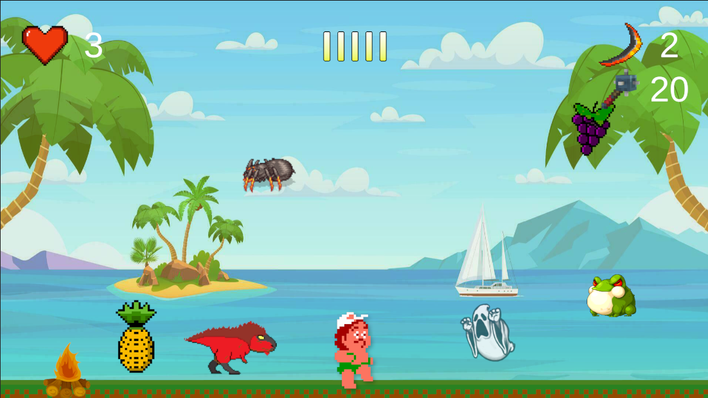
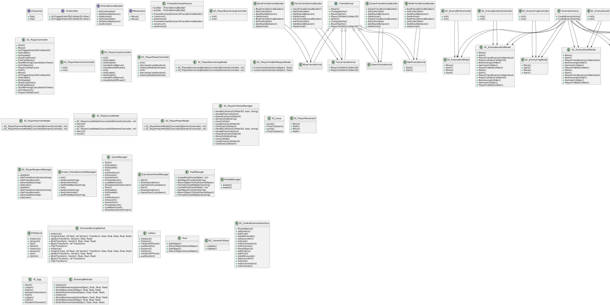

# Unity Game Project - Advanture Island replica.

## Overview

This is a Unity-based game featuring a player character that interacts with various friendly animals and enemies. The game includes 2 levels, collectible items, and various mechanics to provide an engaging gameplay experience.
The game implemented using SOLID principles and Design patterns such as factor and builder.

## How to Play

1. **Movement**: Use the arrow keys to move the player character.
2. **Jump**: Press the spacebar to make the player character jump.
3. **Attack**: Use the 'X' key to use the boomerang weapon and the 'Z' key to use the hammer weapon.
4. **Summon Friend Animals**: Press the 'C' key to summon friend animals based on the animal kind.
5. **Objective**: Navigate through the levels, avoid or defeat enemies, collect items, and reach the end of each level to progress.

## Class Diagram

## Project Structure

- **ICharacter**: Interface defining the `Die` method for character classes.
- **ICollectible**: Interface defining the `OnTriggerEnter2D` method for collectible items.
- **IFriendAnimalBuilder**: Interface for building friend animal objects.
- **IMovement**: Interface for movement-related methods.

### Friend Animals
- **FriendAnimal**: Abstract class for friend animals with methods for attacking, changing sprites, and handling player collisions.
  - **BlueFriendAnimal**: Inherits from `FriendAnimal`, defines specific attack behavior.
  - **FairyFriendAnimal**: Inherits from `FriendAnimal`, defines specific attack behavior and collider handling.
  - **GreenFriendAnimal**: Inherits from `FriendAnimal`, defines specific attack behavior.
  - **RedFriendAnimal**: Inherits from `FriendAnimal`, defines specific attack behavior and initializes a fireball weapon.

### Builders
- **BlueFriendAnimalBuilder**: Builder for `BlueFriendAnimal`.
- **FairyFriendAnimalBuilder**: Builder for `FairyFriendAnimal`.
- **GreenFriendAnimalBuilder**: Builder for `GreenFriendAnimal`.
- **RedFriendAnimalBuilder**: Builder for `RedFriendAnimal`.

### Director
- **FriendsAnimalsDirector**: Manages the construction of friend animals using the builder pattern.

### Enemies
- **SC_EnemyBirdController**: Controls bird enemy behavior.
- **SC_EnemyBonefireController**: Controls bonefire enemy behavior.
- **SC_EnemyFrogController**: Controls frog enemy behavior.
- **SC_EnemyGhostController**: Controls ghost enemy behavior.
- **SC_EnemyRockController**: Controls rock enemy behavior.
- **SC_EnemySnakeController**: Controls snake enemy behavior.
- **SC_EnemySpiderController**: Controls spider enemy behavior.

### Factories
- **EnemiesFactory**: Creates enemy objects.
- **FruitsFactory**: Creates fruit collectible objects.
- **WeaponsFactory**: Creates weapon collectible objects.

### Weapons
- **SC_BoomerangWeaponModel**: Model for boomerang weapon.
- **SC_FireBallWeaponModel**: Model for fireball weapon.
- **SC_HammerWeaponModel**: Model for hammer weapon.

### UI Elements
- **SC_PlayerBoomerangController**: Controls boomerang UI element.
- **SC_PlayerController**: Controls player character behavior.
- **SC_PlayerHammerController**: Controls hammer UI element.
- **SC_PlayerLivesController**: Controls player lives UI element.
- **SC_PlayerPowerController**: Controls player power UI element.

### UI Element Models
- **SC_PlayerBoomerangModel**: Model for boomerang UI element.
- **SC_PlayerFireBallWeaponModel**: Model for fireball weapon.
- **SC_PlayerHammerModel**: Model for hammer UI element.
- **SC_PlayerLivesModel**: Model for player lives UI element.
- **SC_PlayerPowerModel**: Model for player power UI element.

### Enemy Models
- **SC_EnemyBirdModel**: Model for bird enemy.
- **SC_EnemyBonefireModel**: Model for bonefire enemy.
- **SC_EnemyFrogModel**: Model for frog enemy.
- **SC_EnemyGhostModel**: Model for ghost enemy.
- **SC_EnemyRockModel**: Model for rock enemy.
- **SC_EnemySnakeModel**: Model for snake enemy.
- **SC_EnemySpiderModel**: Model for spider enemy.

### Concrete Classes
- **SC_PlayerCollisionManager**: Manages player collisions.
- **SC_Jump**: Handles player jumping behavior.
- **SC_PlayerMovement**: Handles player movement.
- **SC_PlayerWeaponsManager**: Manages player weapons.
- **Cards_FriendsAnimalsManaeger**: Manages friend animals.
- **GameManager**: Manages game state and levels.
- **GameOverPanelManeger**: Manages game over screen.
- **PoolManager**: Manages object pooling.
- **PrefabManager**: Manages prefabs.
- **PrefabList**: Maintains a list of prefabs.
- **EnemiesMovingMethod**: Manages enemy movement patterns.
- **Lottery**: Utility class for random decisions.
- **Pool**: Represents an object pool.
- **SC_CameraFollows**: Manages camera following the player.
- **SC_ColAndEnemiesPositions**: Manages placement of collectibles and enemies.
- **SC_Egg**: Manages egg hatching behavior.
- **ShootingMethods**: Utility class for shooting behavior.

## Setup

1. Clone the repository: `git clone <repository-url>`
2. Open the project in Unity.
3. Ensure all prefabs and assets are correctly set up in the `PrefabManager`.
4. In case of this error: The type or namespace name 'TMPro' could not be found do 5
5. 'TMPro' could not be found handling: Go to Window > Package Manager in the Unity Editor. In the Package Manager, find and install the "TextMesh Pro" package. If it's not visible, you may need to change the Package Manager view to "Unity Registry" from the top left dropdown menu.
6. Drag from Assets > Scenes "FirstLevel" and Play the scene.
7. Play the game in the Unity Editor to test and debug.

## Made By
- Gilad Meir

## Contributing

1. Fork the repository.
2. Create a new branch: `git checkout -b my-feature-branch`
3. Make your changes.
4. Commit your changes: `git commit -am 'Add some feature'`
5. Push to the branch: `git push origin my-feature-branch`
6. Submit a pull request.

## License

This project is licensed under the MIT License - see the [LICENSE](LICENSE) file for details.

